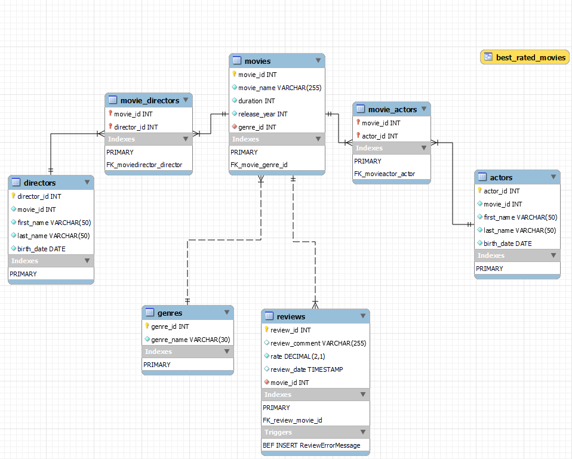

# 📘 SQL Starter Course – Summary & Final Project

This repository contains all the exercises and practice files from my **starter SQL course**, followed by my **final project: DataCinema**.  
The course covered the fundamentals of relational databases and SQL, building up step-by-step from basic queries to full database design.

---

## 🔹 What I Learned in This SQL Course

Throughout the course, I practiced SQL concepts in small, structured modules:

### **1. Basic SQL**
- Creating databases and tables  
- Inserting, updating, and deleting data  
- Selecting and filtering data with `SELECT` and `WHERE`  
- Sorting and limiting results with `ORDER BY` and `LIMIT`

### **2. Joins & Relationships**
- Understanding one-to-many and many-to-many relationships  
- Working with primary and foreign keys  
- Using `INNER JOIN`, `LEFT JOIN`, and `RIGHT JOIN`

### **3. Intermediate SQL**
- Grouping data with `GROUP BY` and filtering with `HAVING`  
- Using aggregate functions like `AVG`, `COUNT`, `SUM`, `MIN`, `MAX`  
- Subqueries inside SELECT, WHERE, and FROM  
- Creating and using database views

### **4. Advanced Features**
- Creating stored procedures  
- Writing user-defined functions  
- Implementing triggers for validation or automation  
- Understanding transactions and variables

---

## 🎬 Final Project: **DataCinema**

The final project puts all the course concepts together by building a small movie-database system called **DataCinema**.

### **Main Features**
- A complete relational schema:
  - Genres  
  - Movies  
  - Directors  
  - Actors  
  - Reviews  
  - Movie–Actor and Movie–Director linking tables  
- A view combining movie data and genre information  
- A function (`GetAverageRatingss`) to calculate average movie ratings  
- A stored procedure (`AddReview`) to insert new reviews  
- A trigger ensuring ratings stay between **1 and 5**

### **Purpose of the Project**
The goal was to demonstrate an understanding of:
- Database design  
- Table relationships  
- Data integrity  
- SQL routines (procedures, functions, triggers)  
- Practical queries and aggregations  

---

This project summarizes my foundational SQL knowledge and serves as my final work for the SQL starter course.
